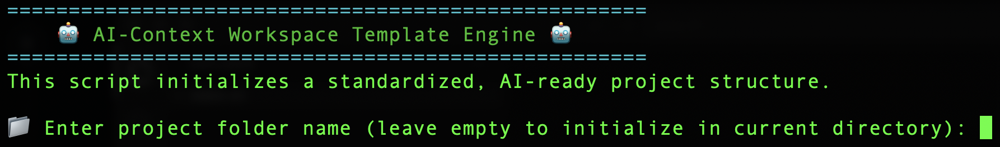
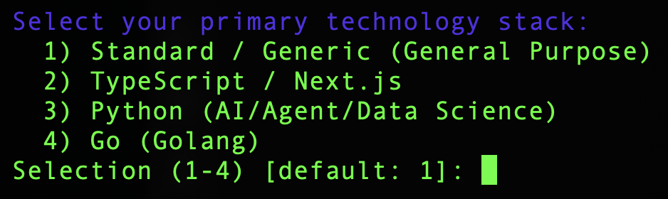
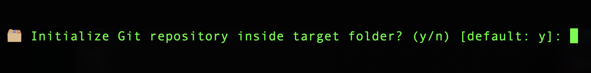
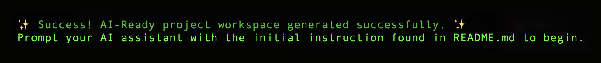
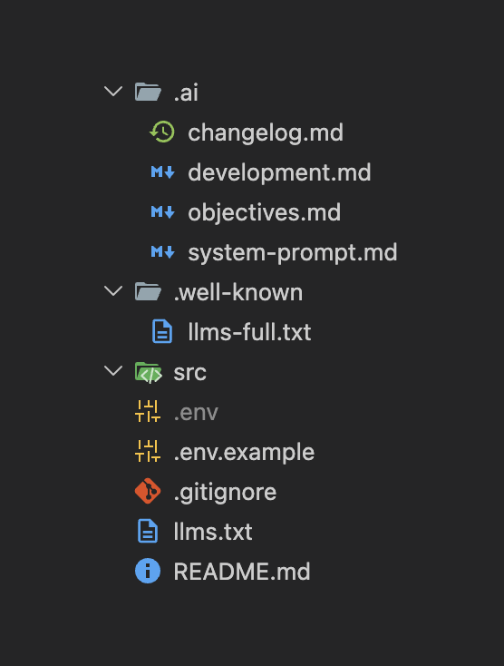

# 🤖 AI-Ready Context Template Engine ⚡

<div align="center">


[](LICENSE)
[](https://github.com/fraconca/ai-ready-context-template-engine/releases)
[](https://github.com/fraconca/ai-ready-context-template-engine/pulls)
[](https://github.com/fraconca/ai-ready-context-template-engine/stargazers)

</div>

---

A standardized, production-ready project workspace structure optimized for **AI-Assisted Development**. This template establishes an architecture-first documentation approach, making it universally compatible with advanced AI agents, autonomous coders, and AI-powered IDEs (such as Cursor, Windsurf, Claude Projects, and OpenAI GPTs).

By enforcing an English-first, LLM-indexed folder structure (`llms.txt` + `.ai/`), any AI agent can instantly ingest the repository, understand its constraints, track the changelog, and start coding immediately without hallucinating or losing context. 🚀

---

## 🗂️ Workspace Architecture

```text
.
├── .env.example             # Standardized environment variables blueprint
├── llms.txt                 # Universal entry point & index for LLM crawlers
├── README.md                # Human-centric project documentation
├── .well-known/
│   └── llms-full.txt        # Full expanded context index for automated tooling
└── .ai/                     # Centralized AI Knowledge Engine
    ├── changelog.md         # Project ledger, version history, and active Todo state
    ├── development.md       # Environment setup, build instructions, and testing protocols
    ├── objectives.md        # Product vision, core features, and out-of-scope boundaries
    └── system-prompt.md     # AI Engineer persona, full tech stack, and coding constraints
```

---

## 🔌 Supported Technology Stacks

The generator script comes pre-configured with optimized context files (`system-prompt.md`, `development.md`, `.gitignore`) and boilerplate files for the following stacks:

1. **Standard / Static HTML, CSS, JS** — General-purpose, static site skeleton.
2. **TypeScript / Next.js** — Next.js (App Router), React, Tailwind CSS, TypeScript, and developer tools.
3. **Python (AI/Agent/Data Science)** — FastAPI, Uvicorn, LangChain, OpenAI, Dotenv, and `.venv` templates.
4. **Go (Golang)** — Basic HTTP server, routing, and `go.mod` module setup.
5. **Node.js (Backend / Express / Fastify)** — Express.js server, dotenv setup, and Nodemon for fast hot-reload.
6. **PHP (Laravel / Vanilla)** — Composer project file, public index router, and PSR-4 App namespaces.
7. **Java (Spring Boot / Maven)** — Maven standard structure, Spring Web, and parent Pom configurations.
8. **.NET (C# / Web API)** — .NET Core 8.0 Minimal APIs, Web SDK, and C# compilation configurations.
9. **Ruby (Rails / Sinatra)** — Sinatra Web API, Gemfile, and Bundler configuration.
10. **Liquid (Shopify Storefront)** — Shopify Theme structure with Skeleton Theme.

---

## 🚀 How to Run and Initialize Your Workspace

You can initialize this structure in your local environment using the remote one-liner below:

```bash
curl -sSL https://raw.githubusercontent.com/fraconca/ai-ready-context-template-engine/main/setup.sh | bash
```

> [!TIP]
> **Windows Users:** Run this command inside **Git Bash** (installed automatically with Git for Windows) or **WSL** (Windows Subsystem for Linux). Standard Windows CMD and PowerShell do not support Bash scripts natively.

---

## 📸 Visual Step-by-Step Walkthrough

#### Step 1: Running the generator


#### Step 2: Selecting your tech stack


#### Step 3: Git repository initialization option


#### Step 4: Workspace generation success


#### Step 5: Generated directory structure


---

## 🤖 How to Prompt the AI Agent

When sharing this folder or opening it in an AI-driven environment for the first time, paste the following baseline instruction into the agent's chat window to initialize its context:

> 💡 "Please read the `llms.txt` file located in the root directory to understand the project map, and strictly follow the operational guidelines inside the `.ai/` directory. Maintain the `.ai/changelog.md` file whenever a feature is completed or when goals shift."

## 🛠️ Customization Workflow

Before starting your development cycle, update these files with your specific project details:
1. **`.ai/system-prompt.md`**: Define your exact tech stack and style guidelines.
2. **`.ai/objectives.md`**: Outline your business logic, app features, and scope limits.
3. **`.ai/changelog.md`**: Set your initial task under `### Immediate Next Steps`.

> [!IMPORTANT]
> **Clean Up & Modify:** The script generates basic boilerplate skeleton files in the `src/` folder (such as `main.py`, `main.go`, or Next.js route files) to help verify your setup. Feel free to modify, rewrite, or delete any of these initial code files to fit your project's specific architecture.

---

## ❓ FAQ (Frequently Asked Questions)

#### Why use the `llms.txt` standard instead of other custom formats (like `AGENTS.md`)?
`llms.txt` is an emerging, industry-wide standard (proposed by Answer.ai) for serving clean, LLM-crawlable context at root endpoints. Automated tools, web crawlers, and AI agents naturally check for `/llms.txt` and `/.well-known/llms-full.txt`. By aligning with this format, your repository becomes universally readable by any agent out of the box, without relying on proprietary structures.

#### What is the difference between using this vs. `.cursorrules`, `claude.md`, or one giant prompt?
* **No Redundancy:** We consolidate persona and stack rules under `.ai/system-prompt.md` (replacing the need for a separate `agent.md` or multiple fragmented prompt files) to keep context concise.
* **Universal Compatibility:** IDE-specific files like `.cursorrules` or `claude.md` only work inside their respective tools. This structure works across **any** LLM platform, custom GPT, or autonomous agent via the `llms.txt` index.
* **Higher Context Attention:** Giant prompts suffer from "lost in the middle" attention degradation and bloat token costs. Splitting context into single-responsibility markdown files ensures agents only digest what is relevant to the active task.

#### Don't modern autonomous agents already manage context automatically?
While agents are getting better at codebase retrieval (RAG), they still lack business intent, product vision, and engineering boundaries. They cannot guess *why* a feature is out of scope or *how* you prefer to structure testing. This template provides **deterministic guidance** that overrides RAG guessing, drastically reducing hallucinations.

#### Does this scale to large codebases (e.g., monorepos or dozens of libraries)?
Yes! For monorepos or multi-project structures, you can host a main `llms.txt` at the root that maps to subfolders, and each sub-project can have its own `.ai/` context folder. This maintains a clean, modular hierarchy that agents can traverse on-demand without overloading their context window.

---

## 📄 License
This template is open-source and available under the [MIT License](LICENSE).