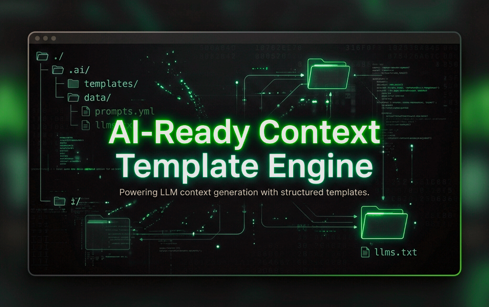

# 🤖 AI-Ready Context Template Engine ⚡

<div align="center">



[](LICENSE)
[](https://github.com/fraconca/ai-ready-context-template-engine/releases)
[](https://github.com/fraconca/ai-ready-context-template-engine/pulls)
[](https://github.com/fraconca/ai-ready-context-template-engine/stargazers)

</div>

---

A standardized, production-ready project workspace structure optimized for **AI-Assisted Development**. This template establishes an architecture-first documentation approach, making it universally compatible with advanced AI agents, autonomous coders, and AI-powered IDEs (such as Cursor, Windsurf, Claude Projects, and OpenAI GPTs).

By enforcing an English-first, LLM-indexed folder structure (`llms.txt` + `.ai/`), any AI agent can instantly ingest the repository, understand its constraints, track the changelog, and start coding immediately without hallucinating or losing context. 🚀

---

## 🗂️ Workspace Architecture

```text
.
├── .env.example             # Standardized environment variables blueprint
├── llms.txt                 # Universal entry point & index for LLM crawlers
├── README.md                # Human-centric project documentation
├── .well-known/
│   └── llms-full.txt        # Full expanded context index for automated tooling
└── .ai/                     # Centralized AI Knowledge Engine
    ├── changelog.md         # Project ledger, version history, and active Todo state
    ├── development.md       # Environment setup, build instructions, and testing protocols
    ├── objectives.md        # Product vision, core features, and out-of-scope boundaries
    └── system-prompt.md     # AI Engineer persona, full tech stack, and coding constraints
```

---

## 🚀 How to Run and Initialize Your Workspace

You can initialize this structure in your local environment using one of the easy methods below.

### 🌐 Method 1: Remote One-Liner (No Download Required)
Open your terminal in any empty directory where you want to create your project and run:
```bash
curl -sSL https://raw.githubusercontent.com/fraconca/ai-ready-context-template-engine/main/setup.sh | bash
```

---

### 💻 Method 2: Local Execution (If you cloned or downloaded this repository)
If you have cloned this repository or downloaded the ZIP file, navigate to the folder in your terminal and choose one of the options below:

#### ⚡ Option A: Direct Bash Run (Easiest)
Run the script using the `bash` interpreter (no need to change file permissions):
```bash
bash setup.sh
```

#### 🛠️ Option B: Standard Executable Run
Grant execution permissions and run the script:
```bash
chmod +x setup.sh
./setup.sh
```

---

### ⚙️ What the Script Will Ask You:
1. **📁 Folder Name**: Press **Enter** to install directly in the current directory, or type a **name** to create a new folder for your project.
2. **🔌 Tech Stack**: Choose your stack (TypeScript/Next.js, Python/AI, Go, or Generic) to automatically fill `.ai/system-prompt.md` and `.ai/development.md` with targeted developer guidelines.
3. **🗂️ Git Initialization**: Choose if you want to initialize a git repository and generate a stack-specific `.gitignore` file.

---

## 🤖 How to Prompt the AI Agent

When sharing this folder or opening it in an AI-driven environment for the first time, paste the following baseline instruction into the agent's chat window to initialize its context:

> 💡 "Please read the `llms.txt` file located in the root directory to understand the project map, and strictly follow the operational guidelines inside the `.ai/` directory. Maintain the `.ai/changelog.md` file whenever a feature is completed or when goals shift."

---

## 🛠️ Customization Workflow

Before starting your development cycle, update these files with your specific project details:
1. **`.ai/system-prompt.md`**: Define your exact tech stack and style guidelines.
2. **`.ai/objectives.md`**: Outline your business logic, app features, and scope limits.
3. **`.ai/changelog.md`**: Set your initial task under `### Immediate Next Steps`.

---

## 📄 License
This template is open-source and available under the [MIT License](LICENSE).